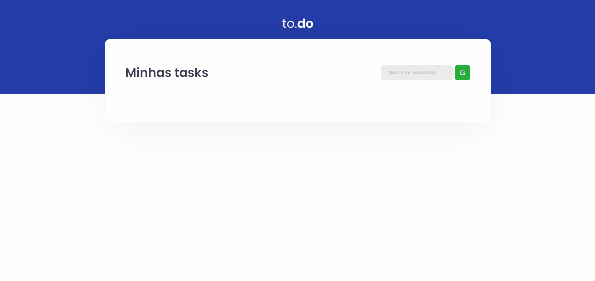

## 🚀 To.do

Aplicação onde o objetivo é criar uma pequena aplicação de atividades a fazer, para treinar um pouco mais sobre manipulação do estado no React.

- Adicionar uma nova tarefa
- Remover uma tarefa
- Marcar e desmarcar uma tarefa como concluída

## 🎥 Projeto

<div align="center">
  
</div>

## 🧰 Tecnologias e Bibliotecas

- [ReactJS](https://pt-br.reactjs.org/tutorial/tutorial.html)
  - [Sass](https://sass-lang.com/)
- [TypeScript](https://www.typescriptlang.org/)

```bash
# Clone este repositório para a pasta anterior
$ git clone https://github.com/diogomfc/ignite-challends-to.do.git
# ou use a opção de download.

# Acesse a pasta dtmoney
$ cd ignite-challends-to.do

# Instale as dependências
$ yarn install
ou
$ npm install

# Executando o Projeto
$ yarn start
ou
$ npm start

# Acesse http://localhost:3000 no seu navagador
```

<div align="center">
  <small>Diogo Silva - 2021</small>
</div>
